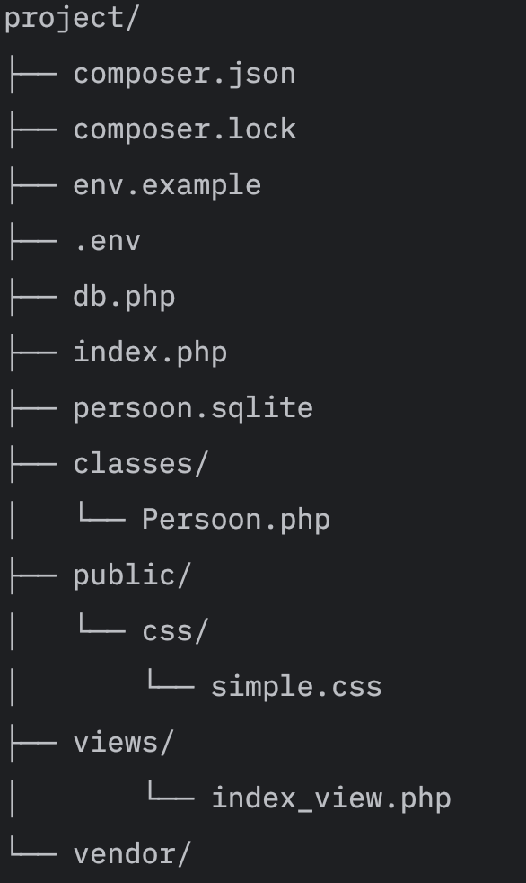
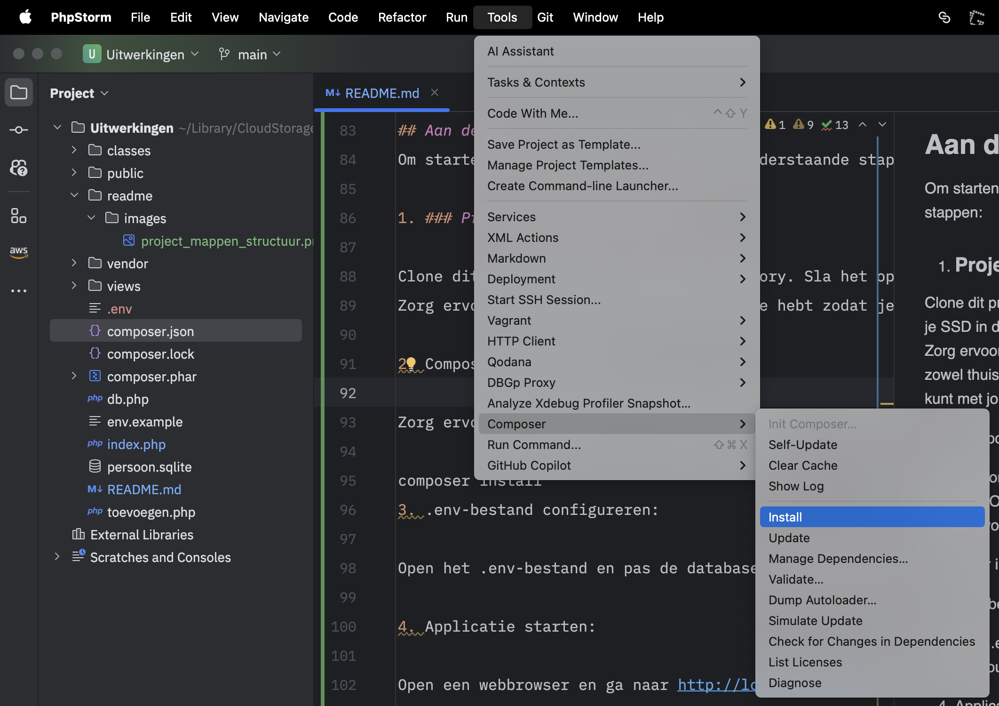
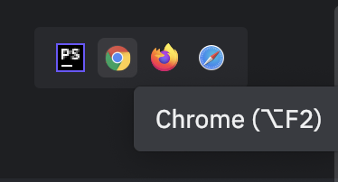

## Welkom bij het Muziek Bibliotheek Project!
In dit project gaan we een applicatie bouwen om jouw favoriete muziekalbums te beheren. We gebruiken moderne PHP-technieken zoals Composer, MVC, en best practices om een gestructureerde en veilige applicatie te creëren.

### Doel:

Het doel van dit project is om een CRUD (Create, Read, Update, Delete) applicatie te bouwen voor het opslaan en beheren van albums van jouw favoriete artiesten.

### Technieken:

* Composer: We gebruiken Composer om dependencies te beheren en onze code te organiseren.
* MVC: We gebruiken een Model-View-Controller (MVC) architectuur om onze code te structureren en scheiding van concerns te realiseren.
* .env: We gebruiken een .env-bestand om gevoelige informatie, zoals database-instellingen, te beschermen.
* SQLite: We gebruiken een SQLite database om onze albumdata op te slaan.
* Best practices: We volgen best practices voor PHP-ontwikkeling, zoals codestijl, documentatie, en testen.

### Functies:

In deze eerste fase van het project focussen we op de Create- en Read-functionaliteit:

* Create: Voeg nieuwe albums toe aan jouw bibliotheek met informatie over artiest, titel, releasedatum, en optioneel genre.
* Read: Bekijk een lijst met alle albums in jouw bibliotheek.

### Uitbreidingen (voor excellente studenten):

* Update: Bewerk bestaande albums in jouw bibliotheek.
* Delete: Verwijder albums uit jouw bibliotheek.
* Album afbeelding: Voeg afbeeldingen toe aan jouw albums.

### Aan de slag:

Volg de instructies in de README.md-file om het project op te zetten en te starten.

## Leerdoelen:

Door te werken aan dit project, leer je:

* Hoe je een PHP-applicatie opzet met Composer en MVC.
* Hoe je met SQLite databases werkt.
* Hoe je .env-bestanden gebruikt om gevoelige informatie te beschermen.
* Best practices voor PHP-ontwikkeling.
* Hoe je een CR(UD)-applicatie bouwt met Create- en Read-functionaliteit.

We hopen dat je plezier hebt met het bouwen van jouw eigen muziek bibliotheek applicatie!

# Het Scaffold Project 
Dit scaffolding project is bedoeld om jou te helpen met het opzetten van een basis PHP applicatie met gebruik van Composer, MVC-structuur en best practices. Het project maakt gebruik van een SQLite database, .env-bestanden, en eenvoudige model-view-controller (MVC) architectuur.

### De projectstructuur is als volgt:

## Toelichting op onderdelen:
1. ### SQLite database:

De persoon.sqlite database bevat data over personen. Studenten kunnen deze database bewerken en bekijken in PHPStorm door naar de "Database" tab te gaan en de database te openen.

2. ### .env en env.example:

env.example: Bevat voorbeeldwaarden voor database-instellingen.
.env: Bevat de daadwerkelijke database-instellingen. Studenten dienen de env.example te hernoemen naar .env en de waardes aan te passen met hun eigen databasegegevens.
Dit project gebruikt de vlucas/phpdotenv Composer dependency om .env-bestanden te laden. Dit verbetert de beveiliging door gevoelige informatie, zoals databasewachtwoorden, uit de code te halen.

3. ### Composer dependency:

De vlucas/phpdotenv Composer dependency is toegevoegd om .env-bestanden te laden. Studenten kunnen deze dependency updaten in PHPStorm door naar "File" -> "Settings" -> "PHP" -> "Composer" te gaan en op "Update" te klikken.

4. ### Databaseconnectie:

De db.php file maakt verbinding met de SQLite database met behulp van PDO. De database naam wordt gelezen uit het .env-bestand.

5. ### MVC-structuur:

Model: De Persoon.php class representeert het data model en bevat logica voor het ophalen, toevoegen, bewerken en verwijderen van persoonsgegevens.
View: De index_view.php file bevat de HTML-code voor de weergave van persoonsgegevens.
Controller: De PersoonController.php class handelt de interactie tussen de gebruiker, het model en de view af.
6. ### CSS:

Het project gebruikt simple.css van https://simplecss.org/simple-css-version-2 om de styling te vereenvoudigen. Studenten kunnen deze CSS aanpassen om het uiterlijk van de applicatie te wijzigen.

7. ### README.md:

Deze README.md-file bevat instructies voor het opzetten en gebruiken van het project.

## Aan de slag:
Om starten met dit project volg je de onderstaande stappen:

1. ### Project clonen van GitHub:

Clone dit project naar een lokale directory. Sla het op, op je SSD in de map PROGRAM1/PHP2/Uitwerkingen.
Zorg ervoor dat je jouw SSD altijd bij je hebt zodat je zowel thuis als op school makkelijk en snel aan de slag kunt met jouw project.

2. ### PHPStorm PHP-runtime instellen:

Volg het stappenplan om de PHP-runtime in PHPStorm in te stellen:
https://www.jetbrains.com/help/phpstorm/configuring-local-interpreter.html
Op de iMac van school staan reeds twee versies van PHP geïnstalleerd: PHP 8.2.6 en PHP 8.2.7. Kies de versie met het hoogste nummer.

Gebruik je een eigen Mac, dan zal je eerst PHP moeten installeren via Homebrew.
Volg de stappen zoals beschreven in dit Medium artikel: https://medium.com/@ridanoor212/how-to-install-and-run-different-php-versions-using-homebrew-on-mac-acc3dad1bb0f

Gebruik je een Windows computer, dan zal je eerst PHP moeten installeren via Chocolatey.
Installeer Chocolatey via de instructies op https://chocolatey.org/install
Installeer PHP via de instructies op https://chocolatey.org/packages/php

3. ### Composer installeren:

Het scaffolding project komt standaard al met Composer.phar geïnstalleerd in het project.
Om het te kunnen gebruiken moet wel eerst de PHP-runtime zijn ingesteld in PHPStorm (Zie Stap 2).
Voer nu via het (hoofd)menu van PHPStorm de Composer commando's uit.

4. ### .env-bestand configureren:

Kopieer het env.example-bestand en hernoem het naar .env.
Open het env-bestand en pas de database-instellingen aan met jouw eigen databasegegevens.
Voor nu is dat alleen nog de parameter "DB_FILE=persoon.sqlite"

5. ### Applicatie starten:

Als de PHP-runtime is ingesteld en de .env-bestand is geconfigureerd, kun je de applicatie starten.
Open de index.php file in PHPStorm en klik chrome-icoon rechts bovenaan de pagina.

